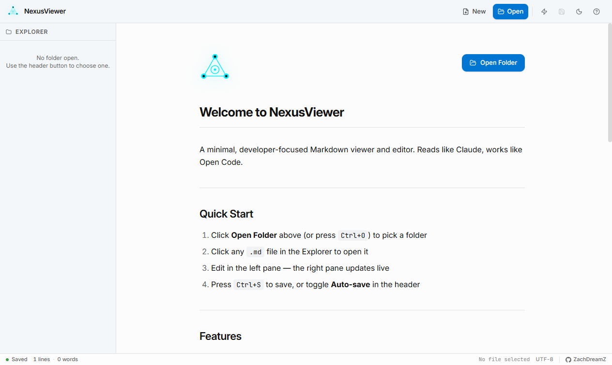
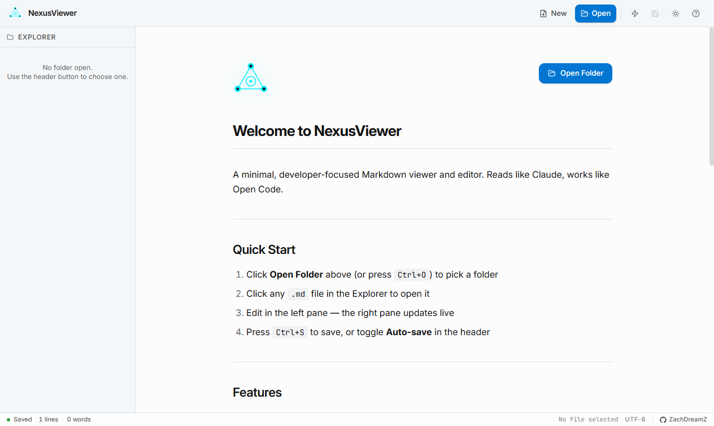
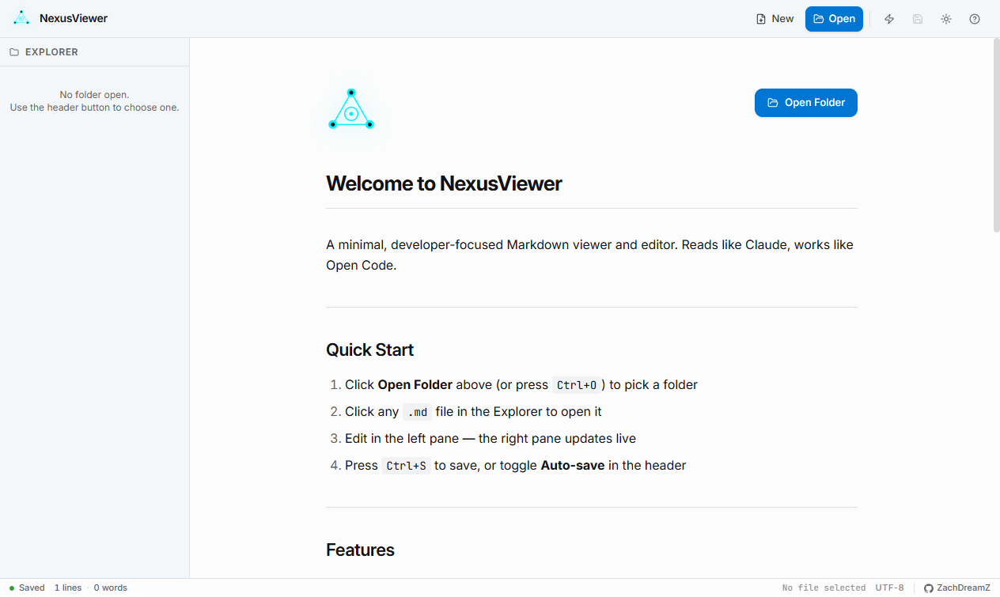

# NexusViewer — Next-Gen Markdown Viewer

A minimal, developer-focused Markdown viewer and editor built with React, TypeScript, and Electron. Fuses Claude's visual minimalism with Open Code's developer-centric power, with a design language inspired by **Apple HIG** (macOS) and the **shadcn/ui** token system.



## Features

- **Live preview** with synchronized scroll between source and rendered output
- **YAML frontmatter** parsing and metadata display
- **GFM support** (tables, task lists, strikethrough) via `remark-gfm`
- **Syntax-highlighted code blocks** via Prism with one-click clipboard copy
- **Project-root sandboxing** — every file operation is constrained to the folder you choose
- **Auto-save** (debounced) with manual save fallback
- **Light / Dark mode** (Apple off-white in light, deep neutral in dark) — persisted across launches
- **File watching** — external changes auto-reload or prompt to reload
- **Keyboard-driven, no telemetry, no cloud**
- **Apple-modern UI** — 13pt body text, 8pt spacing grid, OKLCH semantic tokens, frosted-glass title bar

## Stack

- React 19 + TypeScript
- Vite 8
- Electron 42 (preload-based IPC, context-isolated, sandboxed)
- Tailwind CSS 4 with custom **shadcn-style semantic token system** (OKLCH)
- `react-markdown` + `remark-gfm` + `react-syntax-highlighter`
- chokidar for live file watching

## Quick Start

```bash
npm install
npm run dev              # Vite dev server
npm run electron:start   # Production build + Electron
npm run electron:build:portable   # Portable Windows build
npm run electron:build:installer  # NSIS Windows installer
npm run electron:build:all        # Both portable + installer
```

## Screenshots

| Welcome (dark) | Welcome (light) | About (light) |
| --- | --- | --- |
|  |  |  |

## Design system

NexusViewer uses an Apple HIG + shadcn/ui design token system:
- **OKLCH colors** with semantic `name` / `name-foreground` pairs (`bg-background`, `text-foreground`, `bg-card`, `text-primary`, etc.)
- **macOS body text** at 13pt (`text-body`)
- **8pt spacing grid** (4, 8, 12, 16, 20, 24, 32…)
- **Frosted glass title bar** via `backdrop-filter: blur(20px) saturate(180%)`
- **200ms transitions** with `ease-out` for all hover/active states
- **Sidebar-specific tokens** (`bg-sidebar`, `bg-sidebar-accent`, etc.)

See `.opencode/skills/apple-modern-ui/SKILL.md` for the full design contract.

## Keyboard Shortcuts

| Action | Shortcut |
| --- | --- |
| Open folder | `Ctrl+O` |
| New file | `Ctrl+N` |
| Save | `Ctrl+S` |
| Find | `Ctrl+F` |
| Find & replace | `Ctrl+H` |
| Bold selection | `Ctrl+B` |
| Italic selection | `Ctrl+I` |
| Insert link | `Ctrl+K` |

Editor-formatting shortcuts only trigger when the editor pane is focused, so they won't fight with system shortcuts elsewhere.

## Security Model

The renderer can only read and write files inside the folder you choose via the **Open Folder** button. Any IPC call that resolves outside that root returns `{ success: false, error: 'Path is outside the project root' }`. The renderer runs with `nodeIntegration: false`, `contextIsolation: true`, and `sandbox: true`. External URLs opened via the About dialog are whitelisted to `https?://` only.

## Generating the Logo

```bash
py scripts/generate_logo.py   # writes src/assets/logo.svg + build/icon.{png,ico}
```

## License

MIT — see [LICENSE](./LICENSE).

## Author

[ZachDreamZ](https://github.com/ZachDreamZ)
