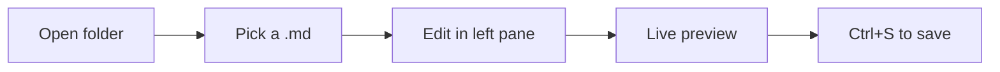

# Welcome to NexusViewer

A minimal, developer-focused Markdown viewer and editor. Reads like Claude, works like Open Code.

---

## Quick Start

1. Click **Open Folder** above (or press `Ctrl+O`) to pick a folder
2. Click any `.md` file in the Explorer to open it
3. Edit in the left pane — the right pane updates live
4. Press `Ctrl+S` to save, or toggle **Auto-save** in the header

---

## Features

- **Live preview** with synchronized scrolling
- **YAML frontmatter** — drop a `---` block at the top to surface metadata
- **GitHub-flavored markdown** — tables, task lists, strikethrough, autolinks
- **Syntax-highlighted code blocks** with one-click clipboard copy
- **Mermaid diagrams** — ` ```mermaid ` blocks render as live SVG
- **KaTeX math** — inline `$...$` and block `$$...$$` equations
- **GitHub-style callouts** — `> [!NOTE]`, `> [!WARNING]`, `> [!TIP]`
- **Heading anchors** — hover any heading to reveal a `#` link
- **Image lightbox** — click any embedded image to expand, use ←/→ to navigate
- **Project-root sandboxing** — every read/write is constrained to the chosen folder
- **Right-click** any file in the Explorer to reveal, rename, or delete
- **Dark / Light mode** — Obsidian dark, Ivory light, persisted across launches

---

## Editing Tips

- **Select text, then `Ctrl+B`** — wraps in `**bold**`
- **Select text, then `Ctrl+I`** — wraps in `*italic*`
- **Press `Ctrl+K`** anywhere to insert a `[text](https://)` link template
- **Press `Ctrl+F`** to find text, **`Ctrl+H`** to find & replace
- **Hover any code block** in the preview to reveal the copy icon

### Example frontmatter

```markdown
---
title: My Document
author: Jane Doe
date: 2026-06-16
tags: [markdown, nexusviewer]
---

Your content here.
```

### Example callouts

> [!NOTE]
> Highlights information that users should take into account, even when skimming.

> [!TIP]
> Helpful advice for doing things better or more easily.

> [!IMPORTANT]
> Crucial information necessary for users to succeed.

> [!WARNING]
> Critical content demanding immediate user attention due to potential risks.

> [!CAUTION]
> Negative potential consequences of an action.

### Example math

Inline: the famous $E = mc^2$ ties mass and energy. The quadratic formula $x = \frac{-b \pm \sqrt{b^2 - 4ac}}{2a}$ solves $ax^2 + bx + c = 0$.

Block:

$$
\int_{-\infty}^{\infty} e^{-x^2} \, dx = \sqrt{\pi}
$$

### Example diagram



---

## Design Philosophy

- **Minimal by default** — no toolbars, no ribbons, no upsells
- **Keyboard-first** — every action has a shortcut (press `?` to see them all)
- **Local-only** — no telemetry, no cloud, no accounts
- **Sandboxed** — the renderer can only read files inside the folder you choose

---

**Ready?** Click **Open Folder** above to begin.
